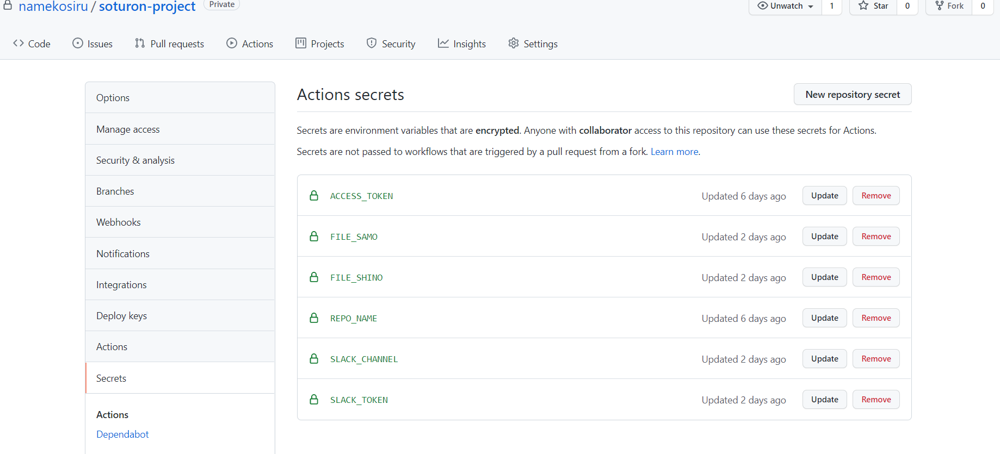

# soturon-project
卒業論文を文字数をカウントして可視化したグラフをslackに投げてくれるアプリです

# 構成図

# preparation
1. 参加者をコラボレーターに招待する
2. `git clone <url>` を実行する
3. soturonproject/files/<卒論>.docxを置く
4. github settingsからsecretsを選択し<卒論>をシークレット変数に登録する
  

5. ymlファイルのenvに渡す変数の編集をする

# Getting started
1. 卒論の進捗を進捗を生む
2. `git add <卒論名>`
3. `git commit -m <適当なメッセージ>`
4. `git push origin master`

